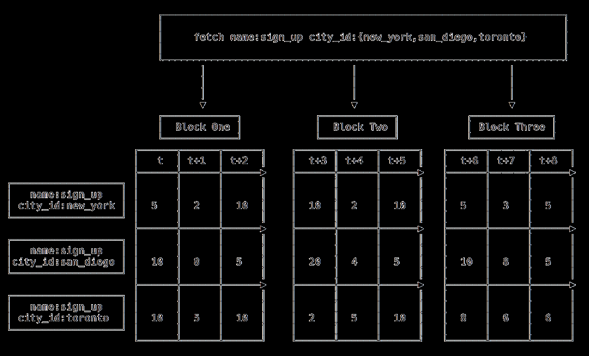

# 概述

## 组件

### M3 Coordinator
`M3 Coordinator`用来协调上游服务(如`prometheus`)与`M3DB`读写操作。
它作为一个桥梁让M3DB与其他监控系统(如promethues)与M3DB让用户获取长期存储和多中心构建。
可以参考promethues关于存储的[ppt](https://schd.ws/hosted_files/cloudnativeeu2017/73/Integrating%20Long-Term%20Storage%20with%20Prometheus%20-%20CloudNativeCon%20Berlin%2C%20March%2030%2C%202017.pdf)

### M3DB
M3DB是一个分布式数据库，具有scalable storage(弹性存储) 与 a reverse index of time series(时间序列的倒排索引)。
它在实时性和长期保留指标是有较好的优势。

### M3 Query
M3 Query是一个查询实时和历史时序数据的分布式Query Engine。

### M3 Aggregator 
M3 Aggregator 是一个专门的指标聚合器，它在M3DB将metrics保存在节点之前提供基于有状态的基于流的下采样。它使用保存在etcd的动态规则。

## 目的
大概内容： 做一个prometheus的存储

## Media
关于博客、MeetUp、Recorded Talks

### [M3: Uber’s Open Source, Large-scale Metrics Platform for Prometheus](https://eng.uber.com/m3/)

#### key word  
global query(查询);  storage(存储) ; downsampling (下采样);retention and rollup rules(保留和汇总规则);hoc retention(临时保留); aggregation(聚合);
rerention rules -- hoc retention; rollup rules -- aggregation;on the fly(没有落盘的都可以称为on the fly);

#### content
The M3 platform aims to provide a turnkey, scalable, and configurable multi-tenant store for Prometheus metrics
M3平台旨在为Prometheus指标提供一个可扩展的、可配置的多租户商店。

M3DB is a distributed time series store and reverse index with configurable out-of-order writes.
M3DB是一个分布式时间序列存储和反向索引，具有可配置的失序写入功能。

Additionally, we are open sourcing M3 Coordinator, a Prometheus sidecar which provides a global query and storage interface on top of M3DB clusters
此外，我们正在开源M3协调器，这是一个普罗米修斯的挎包，在M3DB集群之上提供一个全局查询和存储接口。

The M3 Coordinator also performs downsampling, as well as ad hoc retention and aggregation of metrics using retention and rollup rules.
M3协调器还执行下采样，以及使用保留和汇总规则对指标进行临时保留和汇总。 ad hoc 拉丁文，临时的，特定目的的;downsampling,下采样。

Rollup rules are used to rollup metrics and aggregate in different ways by arbitrary dimensions(任意尺寸) before they are stored.(来自官方文档Mappign Rules章节)

Uber在使用M3之前使用的是[Graphite](https://graphiteapp.org/)，但是因为单点故障（数据没有副本，any single node’s disk failure）会永久失去指标数据。

To ensure the scalability of Uber’s metrics backend, we decided to build out a system that provided fault tolerant metrics ingestion, storage, and querying as a managed platform.
提供一个容错的指标采集、存储、查询的系统管理平台。

M3的五个目标：

- Improved reliability and scalability，提高可靠性和可扩展性
- Capability for queries to return cross-data center results，跨数据中心查询的能力
- Low latency service level agreement，低延迟的服务级别协议
- First-class dimensional “tagged” metrics，OpenMetrics协议(简单来说也就是prometheus数据格式)
- Backwards compatibility，向后兼容

起初的时候M3完全利用开源组件来实现实现重要角色。使用statsite来实现聚合；使用Cassandra来实现时间序列存储，并带有日期分层压缩策略；使用Elasticsearch来做索引；

发布到2015年的时候，M3已经保存了66亿的时序数据，M3每秒聚合5亿时序数据并保存2千万时序数据。
using a quorum write to persist each metric to three replicas in a region。(使用**仲裁**写入将每个指标持久化到一个区域中的三个副本)

M3可以通过配置来对时序数据保存时间(retention)和保存频率(rollup)进行设置

Based on our previous experiences running increasingly high metric storage workloads, we built M3 to:
根据我们之前运行越来越高的指标存储工作负载的经验，我们构建 M3 以：

M3’s metric storage policies define tag (label) matchers to associate retention and downsampling aggregation policies at either fine or coarse-grained levels. 
M3 lets engineers and data scientists define default rules that apply to all metrics, for instance:
M3存储策略定义通过label/tag的matcher来关联retention和rollup的策略.

### [The Billion Data Point Challenge: Building a Query Engine for High Cardinality Time Series Data](https://eng.uber.com/billion-data-point-challenge/)

#### key words
decoupling(解耦); overload(过载);degrade(降级);run out of memory(耗尽内存);fundamental paradigm shift(基本范式转变)

#### content

DAG是为了查询SQL与具体查询逻辑进行解耦，在添加一个新的QL的时候改动量就小了。同时在前方做了一个限流机制。prevent abuse 防止滥用。

The execution phase keeps track of all the running queries and their resource consumption. 
It may reject or cancel a query that results in any resource exhaustion, such as the total available memory for the process
查询阶段会对查询进行跟踪，会拒绝或取消可能会把资源耗尽的查询

The execution phase is decoupled from the storage, allowing us to easily add support for other storage backends.
执行阶段与存储脱钩，使我们能够轻松地增加对其他存储后端的支持

For example, our initial memory limit for a single query was 3.5 GB, a size that enabled us to serve a reasonable amount of traffic without massively over-provisioning our system. 
Still, if a query host received multiple large queries, it would overload and run out of memory.
例如，我们对单个查询的初始内存限制是3.5GB，这个大小使我们能够提供合理的流量，而不至于大规模地过度配置我们的系统。 但是，如果一个查询主机收到多个大型查询，它就会过载并耗尽内存。

Moreover, we realized that once our query service started to degrade, users would continuously refresh their dashboards because the queries were returning too slowly or not at all。
一旦服务降级，用户将持续刷新页面因为查询已经失效了（hhhahah）。恶性循环，导致请求进行积压，使得问题更加复杂。

Furthermore, we found that some power users and platforms built on top of the query service were pushing these memory limits, 
forcing us to think about ways to improve the system’s memory utilization
如何理解这段话？todo 

**Pooling** 

As a result, we started pooling objects such as series and tags, a move that caused a noticeable reduction in the garbage collection overhead.
因此，我们开始对系列和标签等对象进行池化，此举使垃圾收集的开销明显减少。

All of our flame graphs indicated that a lot of time was being spent growing our stack of newly created goroutines (runtime.morestack, runtime.newstack)
所有的火焰图表明，我们花了很多时间来增加新创建的goroutines 堆栈（runtime.morestack、runtime.newstack）

We realized this was occurring because many of our stack calls exceeded the 2 KiB limit, and so the Go runtime was spending a lot of time allocating new 2 KiB goroutines, 
and then immediately throwing them away and copying the stack onto a larger 4 or 8 KiB stack
我们意识到这是因为我们的许多堆栈调用超过了 2 KiB 的限制，因此 Go 运行时花费了大量时间分配新的 2 KiB goroutine， 然后立即将它们扔掉并将堆栈复制到更大的 4 或 8 KiB 堆栈

We decided we could avoid all of these allocations entirely by pooling our goroutines and re-using them via a worker pool.
我们决定通过worker pool来池化goroutine而避免goroutine分配。

**HTTP close notify**

In such situations, the service wastes resources to unnecessarily evaluate a long-running query. 
To remedy this, we added a notifier to detect when the client has disconnected and canceled remaining executions across the different layers of the query service through context propagation.
在这种情况下，服务会浪费资源来对长时间运行的查询进行不必要的评估。为了解决这个问题，我们添加了一个通知程序来检测客户端何时断开连接并通过上下文传播取消跨查询服务不同层的剩余执行。
（**也就是说，在程序中添加了检测机制，同时使用context来控制goroutine的生命周期。**）

**Redesigning for the next order of magnitude**
为下一个量级重新设计

We designed a full MapReduce-style framework for the system with separate query and execution nodes
我们为系统设计了一个完整的 MapReduce 风格的框架，具有单独的查询和执行节点

分为Map阶段和Reduce阶段（感觉类似fan out 和fan in 思想）Map阶段是把一个Query切分成更小的执行单元；Reduce阶段是把结果汇总。

本来快速的实现了该版本，但是发现太复杂了。于是开始寻找其他更简单的方式。

If we delay the decompression as long as possible, we might be able to reduce our memory footprint. 
To achieve this, we decided to take a page out of the functional programming book and redesign our query engine to evaluate functions in a lazy manner, 
delaying allocations of intermediary representations (and sometimes eliminating them entirely) for as long as possible.
如果我们尽量的延后解压，我们可能减少Memory的footprint。为了实现这个目的，我们决定使用懒惰的方式评估函数，尽可能延后中间的解压过程（有些地方甚至可以消除）。

**Data storage**

A block structure allows us to work in parallel on different storage blocks, which greatly improves our computation speed.
这样的Block结构可以让我们并行的在不同的块上做处理，提高我们的计算速度。

一个需要注意的就是如果处理一些函数，如movingAverage，这类函数是就不能并行处理块内容了，因为当前的块可能会以来之前的块。对于有依赖关系的块，我们会先
缓存在内存中，等待不再使用的时候就会将之驱逐。

It is important to note that other monitoring systems, such as Prometheus, advocate for the use of recording rules to pre-aggregate metrics so that these types of problems can be avoided
如prometheus的其他监控系统，提倡配置pre-aggregation 来避免以上问题。

**Reducing metrics latency**

Uber创建双活的M3集群，M3服务可能会服务多个数据中心或者cloud zone。有的场景是需要获取所有数据中心的监控数据，但是每一个M3集群都没有一个全量的数据。
有两种方法来实现该目标，在监控数据写入到M3的时候，同步给其他M3集群；或者是在M3查询的时候将数据结果fanout给其他M3集群。

最初的想法是，当一个请求过来到M3 Cluster1 ，M3 Cluster1 会将该请求fanout 到 M3 Cluster2，M3 Cluster3,M3 Cluster4...，并将请求结果收集，计算，返回结果。
但后来发现，这变成了一个瓶颈，因为跨中心访问很慢，带宽很小，这种实现给每个实例更多的内存压力。

统计发现，跨中心通信 P95的延迟是中心内的10倍。所以采用了两个策略：1） 压缩数据 2）流式传输 。这两点改善让跨中心时延缩减到中心内传输的3倍。

**DownSampling**

用户不关心的数据可以不返回，同时粒度也不需要超过用户的关心之外（这也是下采样的意义所在）

最大三角桶算法 Largest Triangle Three Bucket (LTTB)
使用LTTB作为下采样算法描绘出来的指标模型数据是最接近真实数据的。有三张比较图，真实数据、平均采样、LTTB采样。其中LTTB采样对数据的毛刺处理明显，可以让开发者关注到其异常。
真实数据最能描述数据的真实状态，但是采样的时间长，这也是取舍问题。

**M3QL**

M3QL类似于Linux中的管道

**Support for Prometheus**

## RoadMap

